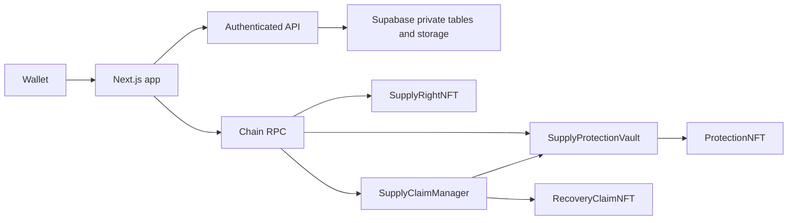

# Architecture

The onchain protocol runs on Anvil (31337) or Sepolia (11155111). Collateral and payouts are **native ETH**, the same asset that pays gas; there is no settlement token. Next.js uses React, wagmi/viem, RainbowKit, React Query, Tailwind, and Supabase.

| Contract | Responsibility |
| --- | --- |
| `SupplyRightNFT` | Registrar minting, buyer identity, documents, delivery lifecycle |
| `SupplyProtectionVault` | Native-ETH free/locked collateral, requests, provider decisions, payout/release; refuses plain ETH transfers |
| `ProtectionNFT` | Vault-issued funded protection terms/status; nontransferable |
| `SupplyClaimManager` | Evidence, independent decisions, objection/appeal, atomic settlement |
| `RecoveryClaimNFT` | Settlement-issued recovery record and holder-reported progress |

Deployment binds counterpart contracts once. Providers fully fund coverage before activation. Only the caller's free collateral is withdrawable; locked collateral stays tied to protection and claim guards.

Settlement pays the beneficiary and mints a Recovery NFT to the provider in one transaction. Failure in either step reverts everything. Payout is verified loss × coverage basis points, capped by remaining coverage and locked funds. Deadline passage permits filing; it does not approve claims.

Supabase stores `agreements`, `documents`, `materials`, `products`, and `dependencies`, with bytes in private `supply-documents` storage. Documents use server-side SHA-256. Quantities have 3 implied decimals; ETH amounts are wei (18). Production disruption estimates are private business inputs, separate from claim verification.

The API authenticates wallet signatures and evaluates onchain roles before using the server-only service-role client. RLS and revoked public table grants protect direct access. Evaluating roles have broad commercial access; buyer access is API-scoped.

The frontend reads real snapshots, balances, roles, and events. Confirmed writes invalidate protocol queries. Progress reports simulation, signature, broadcast, and successful receipt; timelines use real events.

The server reads numeric JSON files from `CONTRACTS_DEPLOYMENTS_DIR` (default `../contracts/deployments`). The `SUPPLYRIGHT_DEPLOYMENTS` JSON array overrides matching files. `npm run sync:contracts` generates `web/src/generated/abis.ts` from Foundry output.
